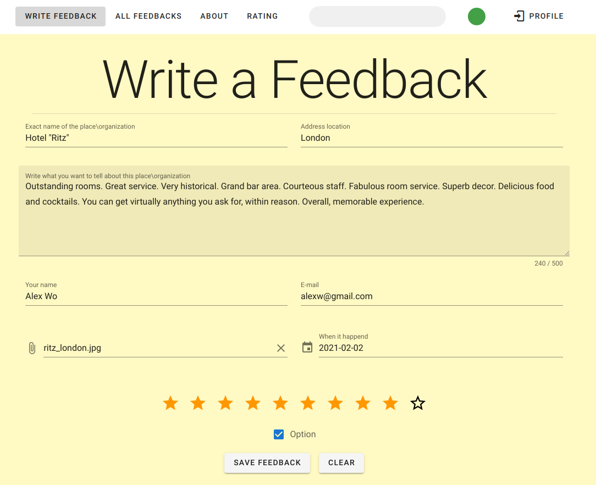
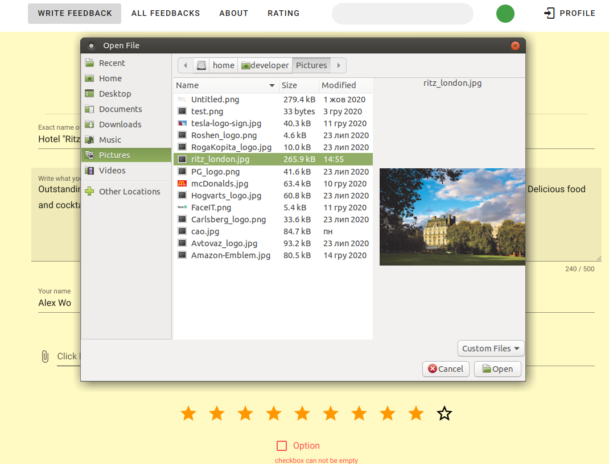
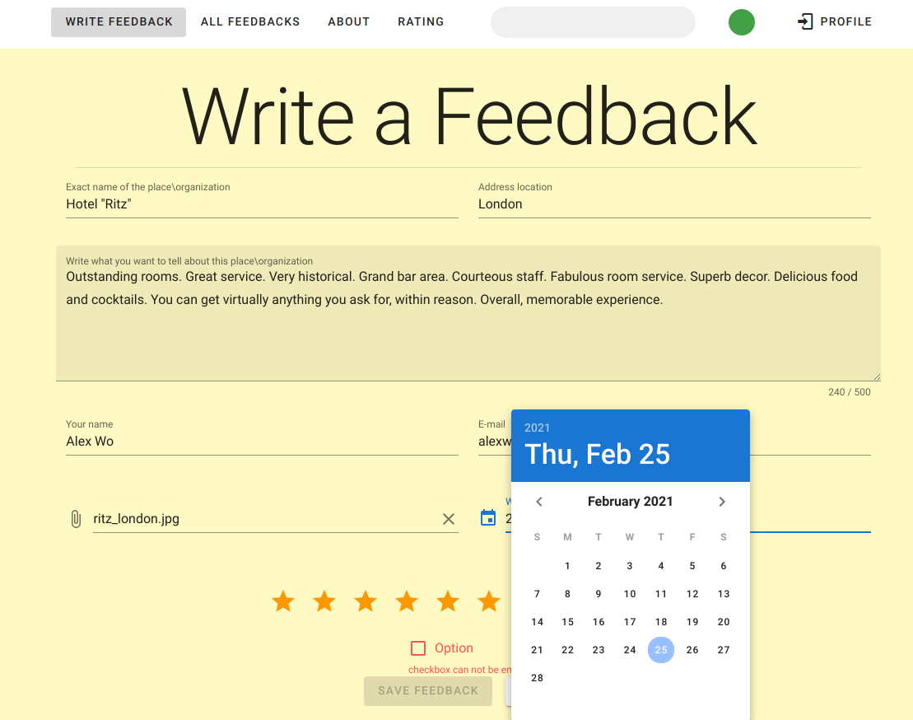
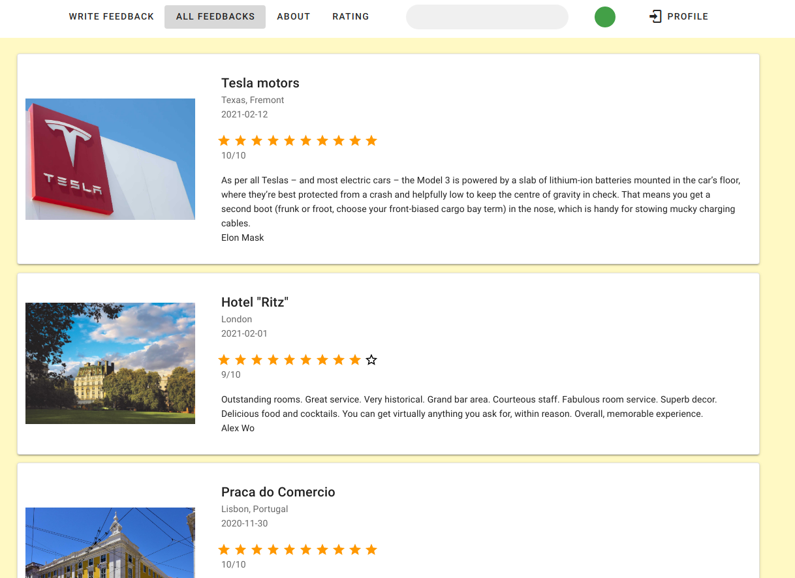
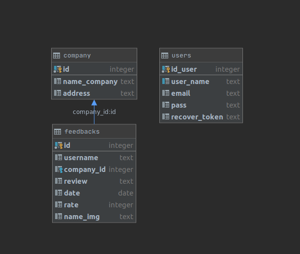

# feedbacks-vuetify
<br>
This is front part of full-stack SPA allow user to create own full feedback(s), add picture etc. <br>
Here is uses Vue, Vuex, Vuetify.<br>
As backend use "feedbacks-backend" repository.<br>
All data store in PostgresQL DB. However, backend part is written using node.js+bookshelf.js, that allows to choose another DBMS.<br>
Expected soon next functional: Authentication, Forgot password and e-mail recover, Feedbacks filter.<br>
<p>

<br>

<br>

<br>

</p>
<br>
Data base visualisation :

<br>

## Project setup
```
npm install
```

### Compiles and hot-reloads for development
```
npm run serve
```

### Compiles and minifies for production
```
npm run build
```

### Lints and fixes files
```
npm run lint
```

### Customize configuration
See [Configuration Reference](https://cli.vuejs.org/config/).
